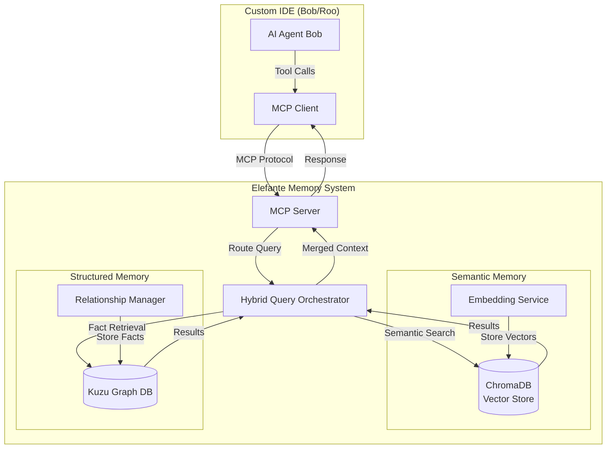
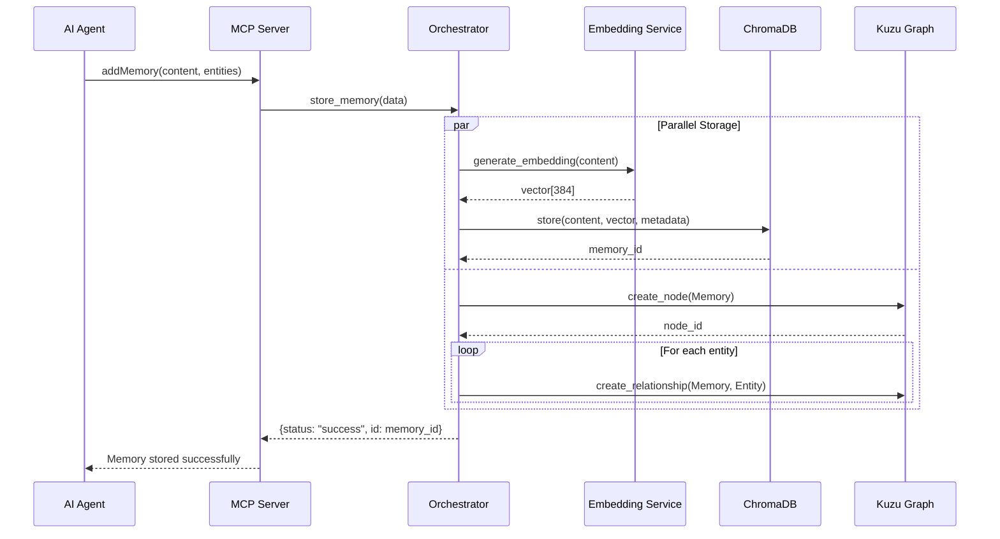
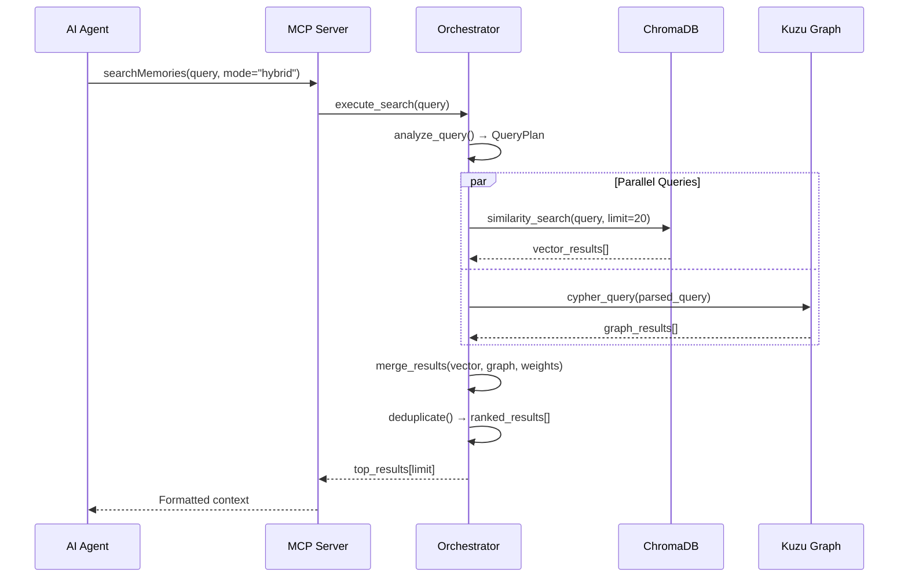

# Elefante - Local AI Memory System Architecture

**Version:** 1.0.0  
**Date:** 2025-11-25  
**Status:** Design Phase  

---

## 1. Executive Summary

**Elefante** (Spanish for "Elephant" - symbolizing perfect memory) is a local, private, and zero-cost persistent memory system designed to give the Bob AI assistant stateful intelligence. It solves the "Zero Persistent Memory" constraint by implementing a dual-database architecture that combines semantic search (Vector DB) with structured knowledge graphs (Graph DB).

### Core Principles
- **Privacy First**: All data stored locally on user's machine
- **Zero Cost**: Free, open-source components only
- **Dual Intelligence**: Semantic + Structured memory for comprehensive recall
- **MCP Native**: Built for Model Context Protocol integration
- **Failure-Proof**: Redundant storage, graceful degradation

---

## 2. System Architecture Overview



---

## 3. Component Specifications

### 3.1 ChromaDB (Vector Database)

**Purpose**: Semantic memory for fuzzy, meaning-based retrieval

**Technology**: ChromaDB v0.4.x
- File-based persistence (no server required)
- Built-in embedding support
- Efficient similarity search
- Metadata filtering

**Storage Location**: `Elefante/data/chroma/`

**Schema Design**:
```python
Collection: "memories"
├── id: UUID (unique identifier)
├── document: str (memory content)
├── embedding: vector[384] (semantic representation)
└── metadata:
    ├── timestamp: ISO8601
    ├── memory_type: str (conversation|fact|insight|code)
    ├── importance: int (1-10)
    ├── tags: list[str]
    ├── source: str (user|agent|system)
    └── session_id: UUID
```

**Embedding Strategy**:
- **Primary**: Sentence Transformers (all-MiniLM-L6-v2)
  - 384-dimensional vectors
  - Fast, local inference
  - No API calls required
- **Fallback**: OpenAI text-embedding-3-small (if user configures API key)

### 3.2 Kuzu Graph Database

**Purpose**: Structured memory for deterministic fact retrieval

**Technology**: Kuzu v0.1.x
- Embedded graph database (in-process)
- Cypher-like query language
- Zero-server architecture
- ACID transactions

**Storage Location**: `Elefante/data/kuzu/`

**Graph Schema**:

```cypher
// Node Types
(:Memory {id, content, timestamp, type})
(:Entity {id, name, type})  // person, project, file, concept
(:Session {id, start_time, end_time})
(:Task {id, description, status, priority})

// Relationship Types
(:Memory)-[:RELATES_TO]->(:Entity)
(:Memory)-[:PART_OF]->(:Session)
(:Entity)-[:DEPENDS_ON]->(:Entity)
(:Task)-[:BLOCKS]->(:Task)
(:Memory)-[:REFERENCES]->(:Memory)
(:Entity)-[:CREATED_IN]->(:Session)
```

**Example Queries**:
```cypher
// Find all memories about a specific project
MATCH (m:Memory)-[:RELATES_TO]->(e:Entity {name: "Elefante"})
RETURN m.content, m.timestamp
ORDER BY m.timestamp DESC

// Find blocking dependencies
MATCH (t1:Task)-[:BLOCKS]->(t2:Task)
WHERE t2.status = "in_progress"
RETURN t1.description, t2.description
```

### 3.3 Hybrid Query Orchestrator

**Purpose**: Intelligent routing between Vector and Graph databases

**Decision Logic**:

```python
def route_query(query: str, context: dict) -> QueryPlan:
    """
    Determines which database(s) to query based on query characteristics
    """
    
    # Semantic indicators (use Vector DB)
    semantic_keywords = ["similar", "like", "about", "related to", "reminds"]
    
    # Structural indicators (use Graph DB)
    structural_keywords = ["who", "what", "when", "depends", "blocks", "affects"]
    
    # Hybrid indicators (use both)
    hybrid_keywords = ["everything about", "full context", "all information"]
    
    if any(kw in query.lower() for kw in hybrid_keywords):
        return QueryPlan(mode="HYBRID", vector_weight=0.6, graph_weight=0.4)
    
    elif any(kw in query.lower() for kw in structural_keywords):
        return QueryPlan(mode="GRAPH_PRIMARY", vector_weight=0.2, graph_weight=0.8)
    
    elif any(kw in query.lower() for kw in semantic_keywords):
        return QueryPlan(mode="VECTOR_PRIMARY", vector_weight=0.8, graph_weight=0.2)
    
    else:
        # Default: Hybrid with balanced weights
        return QueryPlan(mode="HYBRID", vector_weight=0.5, graph_weight=0.5)
```

**Result Merging Strategy**:
1. Execute queries in parallel (async)
2. Normalize scores (0-1 range)
3. Apply weights based on QueryPlan
4. Deduplicate by content hash
5. Sort by combined relevance score
6. Return top N results

---

## 4. MCP Tool Definitions

### 4.1 Core Tools

#### `addMemory`
```json
{
  "name": "addMemory",
  "description": "Store a new memory in both semantic and structured databases",
  "inputSchema": {
    "type": "object",
    "properties": {
      "content": {
        "type": "string",
        "description": "The memory content to store"
      },
      "memory_type": {
        "type": "string",
        "enum": ["conversation", "fact", "insight", "code", "decision"],
        "default": "conversation"
      },
      "importance": {
        "type": "integer",
        "minimum": 1,
        "maximum": 10,
        "default": 5
      },
      "tags": {
        "type": "array",
        "items": {"type": "string"}
      },
      "entities": {
        "type": "array",
        "items": {
          "type": "object",
          "properties": {
            "name": {"type": "string"},
            "type": {"type": "string"}
          }
        },
        "description": "Entities to create relationships with in graph DB"
      }
    },
    "required": ["content"]
  }
}
```

#### `searchMemories`
```json
{
  "name": "searchMemories",
  "description": "Search memories using semantic similarity and/or structured queries",
  "inputSchema": {
    "type": "object",
    "properties": {
      "query": {
        "type": "string",
        "description": "The search query"
      },
      "mode": {
        "type": "string",
        "enum": ["semantic", "structured", "hybrid"],
        "default": "hybrid"
      },
      "limit": {
        "type": "integer",
        "default": 10,
        "minimum": 1,
        "maximum": 100
      },
      "filters": {
        "type": "object",
        "properties": {
          "memory_type": {"type": "string"},
          "min_importance": {"type": "integer"},
          "tags": {"type": "array", "items": {"type": "string"}},
          "date_range": {
            "type": "object",
            "properties": {
              "start": {"type": "string", "format": "date-time"},
              "end": {"type": "string", "format": "date-time"}
            }
          }
        }
      }
    },
    "required": ["query"]
  }
}
```

#### `queryGraph`
```json
{
  "name": "queryGraph",
  "description": "Execute Cypher-like queries on the knowledge graph",
  "inputSchema": {
    "type": "object",
    "properties": {
      "cypher_query": {
        "type": "string",
        "description": "Cypher query to execute"
      },
      "parameters": {
        "type": "object",
        "description": "Query parameters"
      }
    },
    "required": ["cypher_query"]
  }
}
```

#### `getContext`
```json
{
  "name": "getContext",
  "description": "Retrieve full context for current session/task",
  "inputSchema": {
    "type": "object",
    "properties": {
      "session_id": {"type": "string"},
      "depth": {
        "type": "integer",
        "default": 2,
        "description": "Relationship traversal depth"
      }
    }
  }
}
```

### 4.2 Management Tools

#### `createEntity`
```json
{
  "name": "createEntity",
  "description": "Create a new entity in the knowledge graph",
  "inputSchema": {
    "type": "object",
    "properties": {
      "name": {"type": "string"},
      "type": {"type": "string"},
      "properties": {"type": "object"}
    },
    "required": ["name", "type"]
  }
}
```

#### `createRelationship`
```json
{
  "name": "createRelationship",
  "description": "Create a relationship between entities",
  "inputSchema": {
    "type": "object",
    "properties": {
      "from_entity": {"type": "string"},
      "to_entity": {"type": "string"},
      "relationship_type": {"type": "string"},
      "properties": {"type": "object"}
    },
    "required": ["from_entity", "to_entity", "relationship_type"]
  }
}
```

---

## 5. Directory Structure

```
Elefante/
├── ARCHITECTURE.md              # This document
├── README.md                    # User-facing documentation
├── requirements.txt             # Python dependencies
├── setup.py                     # Package configuration
├── .env.example                 # Configuration template
│
├── src/
│   ├── __init__.py
│   ├── core/
│   │   ├── __init__.py
│   │   ├── orchestrator.py      # Hybrid query orchestrator
│   │   ├── vector_store.py      # ChromaDB wrapper
│   │   ├── graph_store.py       # Kuzu wrapper
│   │   └── embeddings.py        # Embedding service
│   │
│   ├── mcp/
│   │   ├── __init__.py
│   │   ├── server.py            # MCP server implementation
│   │   ├── tools.py             # Tool definitions
│   │   └── handlers.py          # Tool execution handlers
│   │
│   ├── models/
│   │   ├── __init__.py
│   │   ├── memory.py            # Memory data models
│   │   ├── entity.py            # Entity data models
│   │   └── query.py             # Query plan models
│   │
│   └── utils/
│       ├── __init__.py
│       ├── config.py            # Configuration management
│       ├── logger.py            # Logging setup
│       └── validators.py        # Input validation
│
├── data/                        # Created at runtime
│   ├── chroma/                  # ChromaDB storage
│   └── kuzu/                    # Kuzu graph storage
│
├── tests/
│   ├── __init__.py
│   ├── test_vector_store.py
│   ├── test_graph_store.py
│   ├── test_orchestrator.py
│   ├── test_mcp_server.py
│   └── test_integration.py
│
├── scripts/
│   ├── init_databases.py       # Initialize databases
│   ├── migrate_data.py         # Data migration utilities
│   └── health_check.py         # System health verification
│
└── docs/
    ├── API.md                   # API documentation
    ├── EXAMPLES.md              # Usage examples
    └── TROUBLESHOOTING.md       # Common issues
```

---

## 6. Data Flow Diagrams

### 6.1 Memory Storage Flow



### 6.2 Hybrid Search Flow



---

## 7. Configuration Management

### 7.1 Configuration File (`config.yaml`)

```yaml
elefante:
  version: "1.0.0"
  data_dir: "./data"
  
  vector_store:
    type: "chromadb"
    persist_directory: "./data/chroma"
    collection_name: "memories"
    embedding_model: "all-MiniLM-L6-v2"
    distance_metric: "cosine"
    
  graph_store:
    type: "kuzu"
    database_path: "./data/kuzu"
    buffer_pool_size: "512MB"
    
  orchestrator:
    default_mode: "hybrid"
    vector_weight: 0.5
    graph_weight: 0.5
    max_results: 10
    
  mcp_server:
    name: "elefante-memory"
    version: "1.0.0"
    port: 3000  # Optional HTTP endpoint
    
  embeddings:
    provider: "sentence-transformers"
    model: "all-MiniLM-L6-v2"
    device: "cpu"  # or "cuda" if GPU available
    batch_size: 32
    
  logging:
    level: "INFO"
    file: "./logs/elefante.log"
    max_size: "10MB"
    backup_count: 5
```

---

## 8. Performance Specifications

### 8.1 Target Metrics

| Operation | Target Latency | Notes |
|-----------|---------------|-------|
| Add Memory | < 100ms | Excluding embedding generation |
| Semantic Search | < 200ms | For 10k memories |
| Graph Query | < 50ms | Simple traversal (depth 2) |
| Hybrid Search | < 300ms | Combined operation |
| Embedding Generation | < 50ms | Per memory (local model) |

### 8.2 Scalability Targets

- **Memory Capacity**: 100,000+ memories
- **Concurrent Queries**: 10+ simultaneous
- **Storage Efficiency**: < 1KB per memory (excluding embeddings)
- **Embedding Storage**: ~1.5KB per memory (384-dim float32)

---

## 9. Security & Privacy

### 9.1 Data Protection

- **Local Storage Only**: No cloud transmission
- **No Telemetry**: Zero external API calls (except optional OpenAI embeddings)
- **File Permissions**: Restricted to user account
- **Encryption**: Optional at-rest encryption via OS-level tools

### 9.2 Access Control

- **Single-User Model**: Designed for personal use
- **No Authentication**: Relies on OS-level security
- **MCP Protocol**: Inherits security from IDE integration

---

## 10. Error Handling & Resilience

### 10.1 Failure Modes

| Failure | Detection | Recovery |
|---------|-----------|----------|
| ChromaDB unavailable | Connection timeout | Fallback to graph-only mode |
| Kuzu unavailable | Query error | Fallback to vector-only mode |
| Embedding service down | API error | Use cached embeddings or skip |
| Disk full | Write error | Alert user, prevent new writes |
| Corrupted database | Integrity check | Restore from backup |

### 10.2 Graceful Degradation

```python
class MemorySystem:
    def search(self, query: str) -> List[Memory]:
        try:
            # Attempt hybrid search
            return self.orchestrator.hybrid_search(query)
        except ChromaDBError:
            logger.warning("ChromaDB unavailable, using graph only")
            return self.graph_store.search(query)
        except KuzuError:
            logger.warning("Kuzu unavailable, using vector only")
            return self.vector_store.search(query)
        except Exception as e:
            logger.error(f"All search methods failed: {e}")
            return []  # Return empty rather than crash
```

---

## 11. Testing Strategy

### 11.1 Unit Tests

- Vector store operations (CRUD)
- Graph store operations (CRUD)
- Embedding generation
- Query routing logic
- Result merging

### 11.2 Integration Tests

- End-to-end memory storage
- Hybrid search accuracy
- MCP tool execution
- Database synchronization

### 11.3 Performance Tests

- Load testing (1k, 10k, 100k memories)
- Concurrent query handling
- Memory usage profiling
- Query latency benchmarks

---

## 12. Deployment & Installation

### 12.1 System Requirements

- **OS**: Windows 10+, macOS 10.15+, Linux (Ubuntu 20.04+)
- **Python**: 3.9+
- **RAM**: 2GB minimum, 4GB recommended
- **Disk**: 1GB for system, 10GB+ for data
- **CPU**: Any modern processor (GPU optional for embeddings)

### 12.2 Installation Steps

```bash
# 1. Clone repository
git clone <repo-url> Elefante
cd Elefante

# 2. Create virtual environment
python -m venv .venv
source .venv/bin/activate  # or .venv\Scripts\activate on Windows

# 3. Install dependencies
pip install -r requirements.txt

# 4. Initialize databases
python scripts/init_databases.py

# 5. Run health check
python scripts/health_check.py

# 6. Start MCP server (if standalone)
python -m src.mcp.server
```

---

## 13. Future Enhancements

### Phase 2 (Post-MVP)
- [ ] Multi-user support with access control
- [ ] Distributed deployment (client-server architecture)
- [ ] Advanced graph algorithms (PageRank, community detection)
- [ ] Automatic memory consolidation (summarization)
- [ ] Export/import functionality (JSON, CSV)

### Phase 3 (Advanced)
- [ ] Real-time collaboration features
- [ ] Web UI for memory visualization
- [ ] Plugin system for custom memory types
- [ ] Integration with external knowledge bases
- [ ] Advanced analytics dashboard

---

## 14. References & Resources

### Technologies
- **ChromaDB**: https://www.trychroma.com/
- **Kuzu**: https://kuzudb.com/
- **Sentence Transformers**: https://www.sbert.net/
- **MCP Protocol**: https://modelcontextprotocol.io/

### Related Projects
- persistent-ai-memory (SQLite-based predecessor)
- Supermemory.ai (cloud-based inspiration)

---

**Document Status**: ✅ Complete - Ready for Implementation  
**Next Step**: Create detailed implementation plan and begin Phase 1 development
